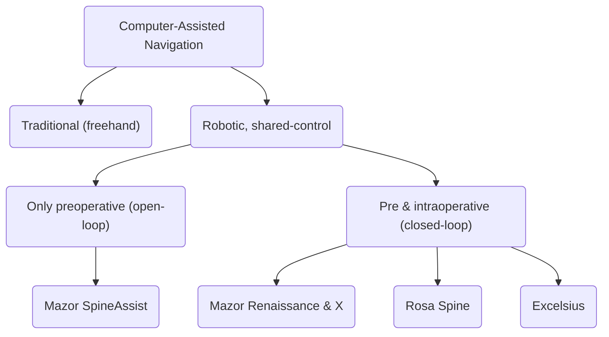
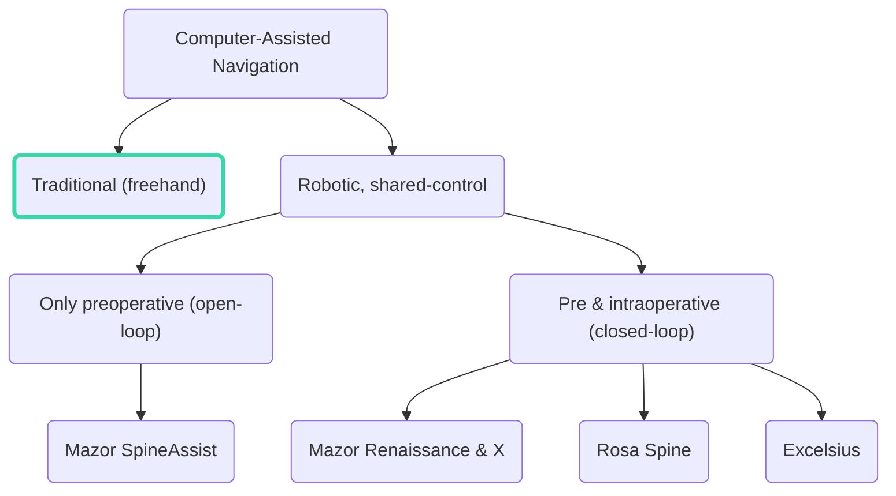
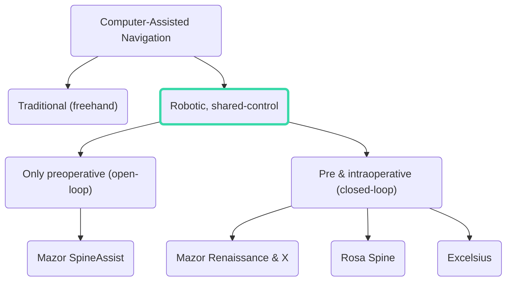
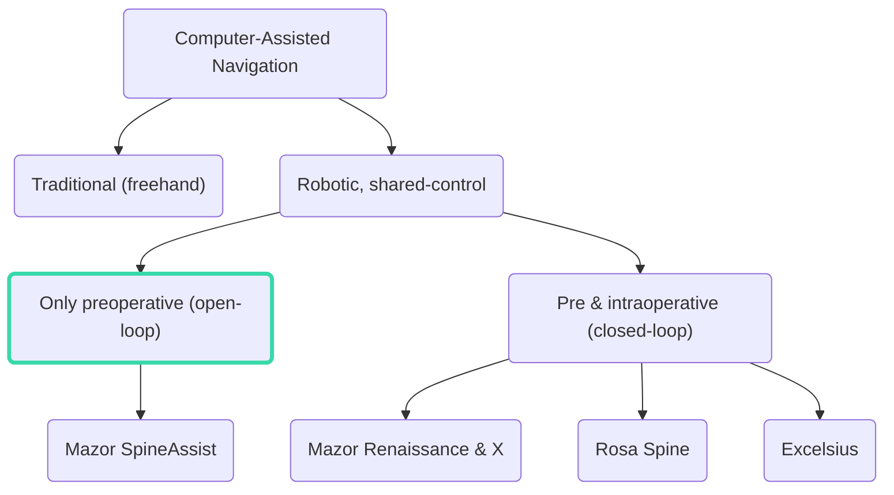
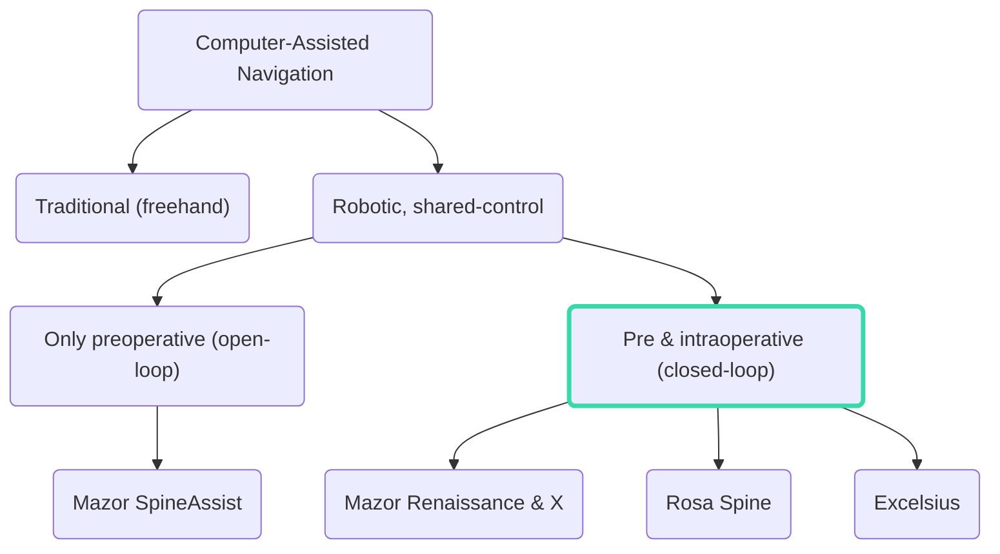

# Learn to Learn Safely

Yarden As

  

    
Jan. 12th 2023

  

---

# Updates

<v-click>

###### New Project: &ldquo;Meta-Learning for Model-Based Reinforcement Learning&rdquo;

* Challenge: adapt efficiently to tasks with varying dynamics.
* Goal: deploy on a real robotic system.
* In collaboration with <a href="https://scholar.google.co.uk/citations?user=EfLpX8QAAAAJ&hl=en">Jonas Rothfuss</a>, <a href="https://las.inf.ethz.ch/people/bhavya-sukhija">Bhavya Sukhija</a>, and Arjun Bhardwaj.
* Extension: apply to safety-critical tasks.

</v-click>

 
 

<v-click>

###### Other
* Mainly writing on my doctoral plan.
* Understanding more closely the application. 

</v-click>

---
layout: image-right
image: https://www.ncbi.nlm.nih.gov/pmc/articles/PMC6844237/bin/RSRR-6-9-g0001.jpg
---

# Today's Topic: Overview of Robotic Surgery Methods.
 

And discussion towards concretizing the problem we aim to solve.

<a href="https://www.dovepress.com/robotic-assisted-spine-surgery-history-efficacy-cost-and-future-trends-peer-reviewed-fulltext-article-RSRR" class="abs-br my-5 mx-5 text-white-sm text-right">SpineAssist Robotic Platform. Image: D’Souza et. al (2019)  Dove Medical Press Limited</a>

---

# Taxonomy of Robotic Guided Spine Surgery

---

# Taxonomy of Robotic Guided Spine Surgery

<!--
* Using Computer Assisted Navigation to localize the operation tools' position and the patients body.
-->

---

# Taxonomy of Robotic Guided Spine Surgery

---

# Taxonomy of Robotic Guided Spine Surgery

---

# Taxonomy of Robotic Guided Spine Surgery

---
layout: two-cols
---

# Case Study
Mazor Robotics SpineAssist [^1]

<v-clicks>

- Take preoperative CT images.
- At the beginning of the procedure: two fluoroscopy (x-ray) images are taken: Anterior-Posterior (front-to-back) and oblique (45 degrees).
- The flouroscopy images are then registered against the preoperative CT images.
- This allows "open-loop" navigation---planning is done preoperatively manually by the surgeon.
- The intraoperative execution is <em>in the physician's hands</em>.

</v-clicks>

[^1]: [SpineAssist](https://pubmed.ncbi.nlm.nih.gov/25146652/)

::right::

<CaptionedImage v-click="2" image="https://www.researchgate.net/profile/Won-Koh/publication/229075792/figure/fig2/AS:216468387045384@1428621493173/AP-and-the-alternative-oblique-views-under-fluoroscopy-AP-view-A-and-the-alternative.png" link="https://www.researchgate.net/figure/AP-and-the-alternative-oblique-views-under-fluoroscopy-AP-view-A-and-the-alternative_fig2_229075792">

AP and the alternative oblique views under fluoroscopy. AP view <b>(A)</b> and the alternative oblique view <b>(B)</b> under fluoroscopy. Image: <a href="https://www.researchgate.net/publication/229075792_An_Alternative_Approach_to_Needle_Placement_in_Cervicothoracic_Epidural_Injections">Park et. al (2012)</a>

</CaptionedImage>

---

# Case Study
Mazor Robotics SpineAssist [^1]

- The physician follows the preoperative plan.
- No online closed-loop guidance by the system.

  <CaptionedImage image="spine-assist.png" link="https://youtu.be/zWBVf5SQkxE">
SpineAssist during operation. Yellow overlay indicates the preoperative plan. Blue overlay indicates the registered tool.
</CaptionedImage>

[^1]: [SpineAssist](https://pubmed.ncbi.nlm.nih.gov/25146652/)

---
layout: image-right
image: https://source.unsplash.com/_qzGiNQDVC8/1920*2880
---

# Questions

<v-clicks>

- Do we have a specific system that we want to build upon?
- What would be a realistic observation space? Intraoperative fluoroscopy + preoperative CT?
- What would be a realistic action space? Joint positions? End-effector position & orientation?
- Helping the surgeon follow the preoperative plan? Online planning? Only offline (manual) planning?

</v-clicks>
