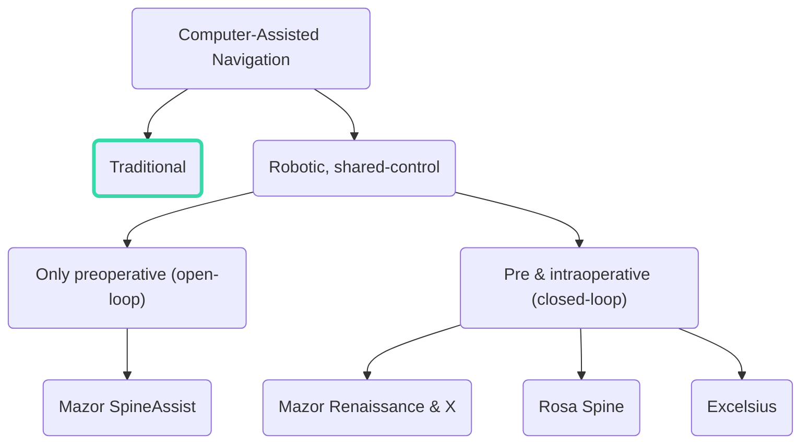
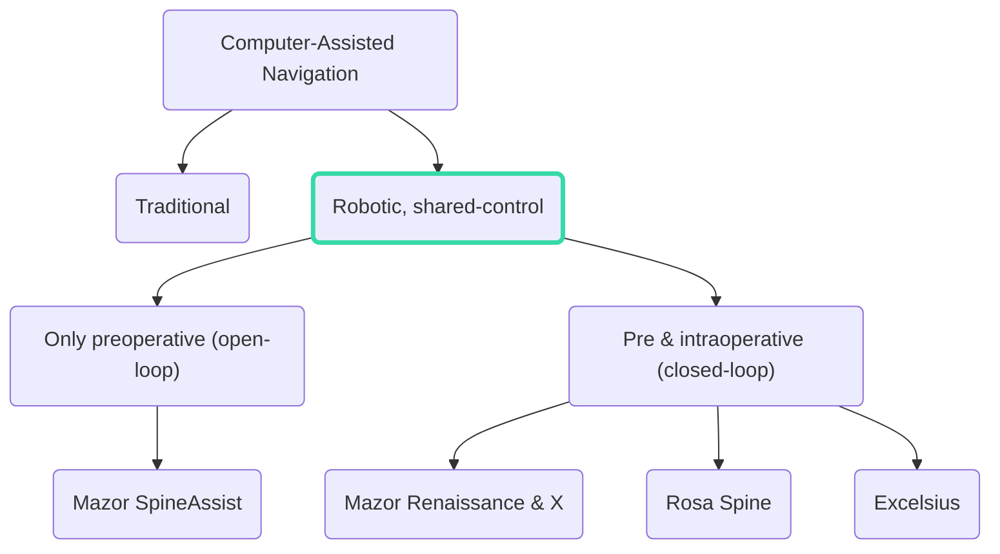
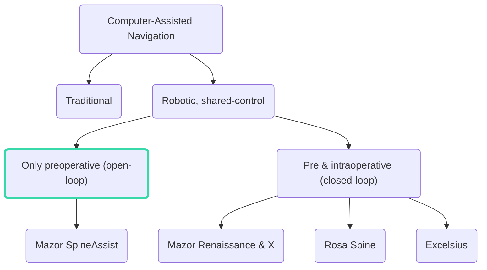
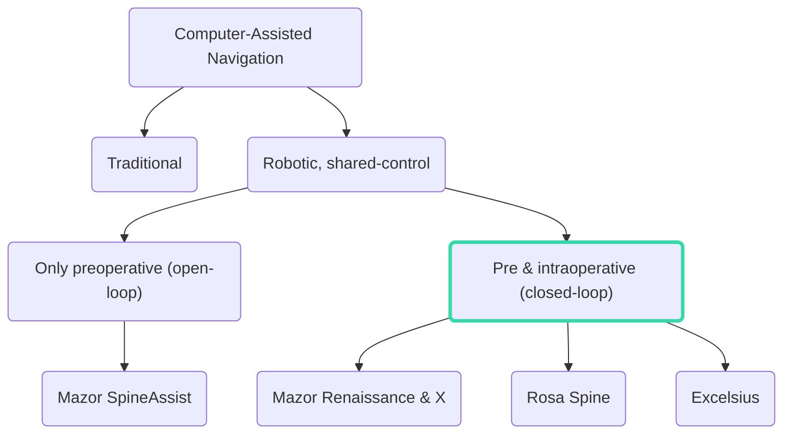

# Learn to Learn Safely

Yarden As

  

    
Jan. 10th 2023

  

---

# Yarden As

PhD student @ <a href="https://las.inf.ethz.ch/" target="_blank">Learning & Adaptive Systems</a>. 
Working on safe reinforcement learning. 

  <ri-github-line class="opacity-50"/>
  
<a href="https://github.com/yardenas" target="_blank">yardenas</a>

  <ri-twitter-line class="opacity-50"/>
  
<a href="https://twitter.com/yarden_as" target="_blank">yarden_as</a>

---

# Taxonomy of Robotic Guided Spine Surgery

<v-clicks>

</v-clicks>

---
layout: two-cols
---

# Example

<v-clicks>

- Example [^1]
- Preoperative CT images are taken
- At the beginning of the procedure: two fluoroscopy (x-ray) images are taken: Anterior-Posterior (front-to-back) and oblique (45 degrees).
- The flouroscopy images are then registered against the preoperative CT images.
- This allows "open-loop" navigation---planning is done manually by the surgeon. Planning seems to be easy.

</v-clicks>

[^1]: [Mazor Robotics Renaissance](https://neurosurgicalassociatespc.com/mazor-robotics-renaissance-guidance-system/patient-information-about-renaissance/)

::right::

<CaptionedImage v-click="3" image="https://www.researchgate.net/profile/Won-Koh/publication/229075792/figure/fig2/AS:216468387045384@1428621493173/AP-and-the-alternative-oblique-views-under-fluoroscopy-AP-view-A-and-the-alternative.png" link="https://www.researchgate.net/figure/AP-and-the-alternative-oblique-views-under-fluoroscopy-AP-view-A-and-the-alternative_fig2_229075792">

AP and the alternative oblique views under fluoroscopy. AP view <b>(A)</b> and the alternative oblique view <b>(B)</b> under fluoroscopy. Image: <a href="https://www.researchgate.net/publication/229075792_An_Alternative_Approach_to_Needle_Placement_in_Cervicothoracic_Epidural_Injections">Park et. al (2012)</a>

</CaptionedImage>

---

# Questions

<v-clicks>

- Freehand/online methods.
- Pre-operative robotic guided methods. [^1]

</v-clicks>
